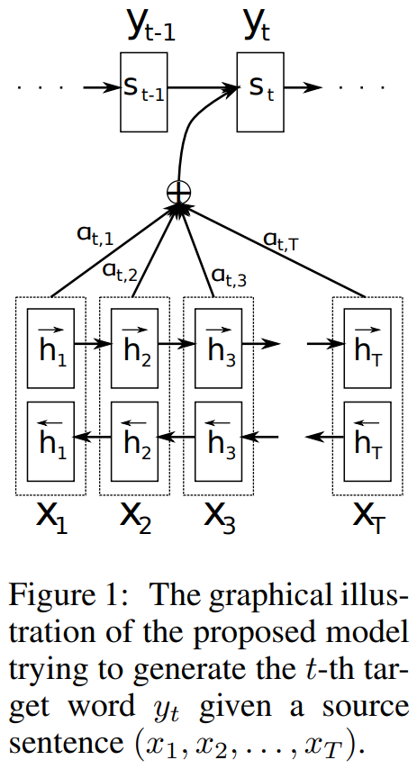

# Bahdanau-Attention-Implementation

"Neural Machine Translation by Jointly Learning to Align and Translate"  by Dzmitry Bahdanau, Kyunghyun Cho and Yoshua Bengio

Paper: https://arxiv.org/pdf/1409.0473.pdf

## Attention Mechanism



## Citation

```bibtex
@misc{bahdanau2016neural,
      title={Neural Machine Translation by Jointly Learning to Align and Translate}, 
      author={Dzmitry Bahdanau and Kyunghyun Cho and Yoshua Bengio},
      year={2016},
      eprint={1409.0473},
      archivePrefix={arXiv},
      primaryClass={cs.CL}
}
```